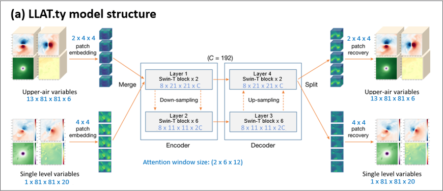
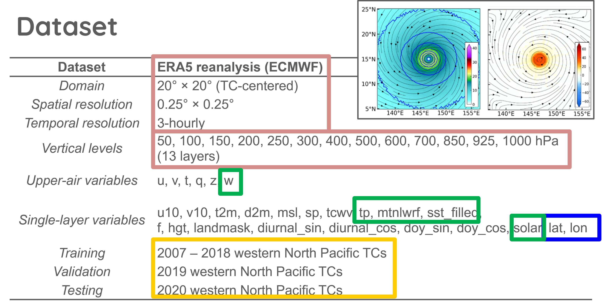
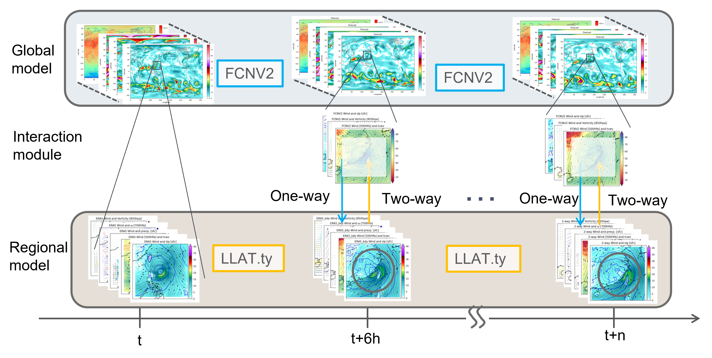
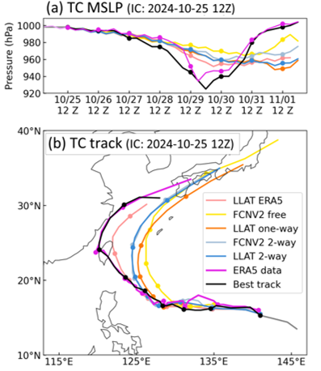

# FCNV2–LLAT Coupled Model Inference

This repository provides the inference workflow for the coupled LLAT–FCNV2 model.

## Model Structures

### LLAT Model Structure

LLAT is a regional, TC-following model designed for tropical cyclone forecasting.  
Its architecture is conceptually similar to Pangu-Weather, but it operates on a moving regional domain centered on the tropical cyclone.



The variables of LLAT model


### FCNV2 Model Structure

FourCastNet V2 (FCNV2) is a global data-driven weather prediction model developed by NVIDIA.

The FCNV2 implementation and weights are based on the following sources:

- https://github.com/ecmwf-lab/ai-models-fourcastnetv2
- https://catalog.ngc.nvidia.com/orgs/nvidia/teams/modulus/models/modulus_fcnv2_sm

## Inference Strategy

The FCNV2–LLAT coupled model supports both one-way and two-way interactions.

- **One-way interaction**:  
  FCNV2 provides lateral boundary conditions for LLAT by replacing the outer 8 grid points of the LLAT domain.

- **Two-way interaction**:  
  The TC structure predicted by LLAT is fed back into FCNV2. Specifically, the 3-D TC structure within 7.5 degrees of the TC center is replaced in the FCNV2 fields.

### Inference Workflow



## Software Requirements
### for LLAT model
**Set Up the Environment**:
   - Ensure you have `micromamba` installed. If not, follow the installation instructions from [Micromamba's documentation](https://mamba.readthedocs.io/en/latest/installation.html).
   - Create and activate the `ty` environment:
     ```bash
     micromamba env create -f regional_model/DLAMPty/env_building/min-win_conda_env.yaml
     micromamba activate ty
     ```
**Download the LLAT model weights**:
The LLAT model weights can be downloaded from:

https://drive.usercontent.google.com/download?id=153kZPubjRA2KSE_bPrdpe2uSRXqP675H&authuser=0

Please place the downloaded weights in:
     ```bash
    regional_model/DLAMPty/onnx
     ```
     
### FCNV2 Model

#### Set up the environment

```bash
micromamba activate ty
pip install -r requirements.txt
```

#### Download the FCNV2 model weights

The FCNV2 model weights are available from NVIDIA NGC:

https://catalog.ngc.nvidia.com/orgs/nvidia/teams/modulus/models/modulus_fcnv2_sm

You can download and prepare the weights using:

```bash
cd global_model/FCNV2
wget 'https://api.ngc.nvidia.com/v2/models/nvidia/modulus/modulus_fcnv2_sm/versions/v0.2/files/fcnv2_sm.zip'
unzip fcnv2_sm.zip
mv fcnv2_sm weight
rm -rf fcnv2_sm.zip
cd ../../
```

### Additional Requirements

Install additional packages for data processing and plotting:

```bash
micromamba activate ty
pip install -q -U xarray zarr gcsfs fsspec dask metpy pysolar cartopy
```

## Running Inference

### 1. Prepare input data from ERA5

The script `download_ERA5_from_google_for_model_input.py` prepares the input data for both FCNV2 and LLAT.

Required arguments:

- `--scheduled-time`: Initial time in `YYYYMMDDHH` format
- `--tc-center`: Initial TC center latitude and longitude
- `--save-folder`: Output folder for the prepared input data

Example:

```bash
python download_ERA5_from_google_for_model_input.py \
    --scheduled-time 2024102500 \
    --tc-center 14.4 144.5 \
    --save-folder input_data
```

### 2. Run one-way or two-way FCNV2–LLAT coupled inference

Required arguments:

- `--FCNV2_IC_path`: Path to the FCNV2 initial condition file
- `--LLAT_IC_path`: Path to the LLAT initial condition file
- `--IC_time`: Initial time in `YYYYMMDDHH` format
- `--save_folder`: Output folder

Optional arguments include:

- `--fore_hour`
- `--FCNV2_weight`
- `--FCNV2_device`
- `--LLAT_yaml`
- `--LLAT_device`

By default, `FCNV2_device` is set to `cuda`.

#### Two-way inference

```bash
python inference_2_way_test.py \
    --FCNV2_IC_path input_data/FCNV2_2024102500_input.npy \
    --LLAT_IC_path input_data/LLAT_2024102500_input.nc \
    --IC_time 2024102500 \
    --save_folder output_data_2_way
    # --FCNV2_device cpu
```

#### One-way inference

```bash
python inference_one_way_test.py \
    --FCNV2_IC_path input_data/FCNV2_2024102500_input.npy \
    --LLAT_IC_path input_data/LLAT_2024102500_input.nc \
    --IC_time 2024102500 \
    --save_folder output_data_one_way
    # --FCNV2_device cpu
```

## Post-processing and Visualization

### 1. Find the TC center

The TC center is defined differently for the two models:

- **FCNV2**: The TC center is identified by tracking the minimum mean sea level pressure.
- **LLAT.ty**: The TC center is defined by the moving-domain center.

Example:

```bash
cd finding_TC_center

python finding_FCNV2_TC_center.py \
    --FCNV2_path ../output_data_2_way/FCNV2 \
    --IC_for_TC_center 14.4 144.5 \
    --IC_time 2024102500 \
    --save_folder ../output_data_2_way

python finding_LLAT_TC_center.py \
    --LLAT_path ../output_data_2_way/LLAT \
    --IC_time 2024102500 \
    --save_folder ../output_data_2_way

cd ..
```

### 2. Plot TC tracks, plan views, and cross sections

All plotting scripts are provided in:

```bash
plot_figure/plot_test.ipynb
```

Open the notebook with:

```bash
cd plot_figure
code plot_test.ipynb
```

Example TC track:


